# 🗄️ CareerKonnekt - Complete Database ERD (Entity Relationship Diagram)

## 📋 Overview
This document contains the comprehensive Entity Relationship Diagram for CareerKonnekt, including both implemented and planned features. The diagram shows all entities, their attributes, data types, constraints, and relationships.

---

# 🎯 Complete ERD Diagram

## PlantUML Code

```plantuml
@startuml CareerKonnekt_ERD

' Styling
skinparam linetype ortho
skinparam rectangle {
    BackgroundColor<<implemented>> #E8F5E9
    BackgroundColor<<planned>> #FFF9C4
    BorderColor Black
    FontSize 11
}

title CareerKonnekt - Complete Database ERD\n(Green = Implemented, Yellow = Planned)

' ============================================
' CORE AUTHENTICATION & USER ENTITIES
' ============================================

entity "User" as user <<implemented>> {
    * **_id** : ObjectId <<PK>>
    --
    * email : String <<unique>>
    * password : String <<hashed>>
    * role : Enum ["applicant", "company", "admin"]
    * is_verified : Boolean <<default: false>>
    --
    verify_otp : String
    verify_otp_expire_at : Date
    reset_password_otp : String
    reset_password_otp_expire_at : Date
    last_login : Date
    created_at : Date <<auto>>
    updated_at : Date <<auto>>
}

entity "Applicant" as applicant <<implemented>> {
    * **_id** : ObjectId <<PK>>
    * user_id : ObjectId <<FK>> <<unique>>
    --
    * name : String
    * email : String
    * phone_no : String
    location : String
    current_role : String
    skills : Array[String]
    experience : Number (years)
    profile_picture_url : String
    linkedin_url : String
    github_url : String
    portfolio_url : String
    bio : String
    date_of_birth : Date
    gender : Enum ["Male", "Female", "Other"]
    created_at : Date <<auto>>
    updated_at : Date <<auto>>
}

entity "Company" as company <<implemented>> {
    * **_id** : ObjectId <<PK>>
    * user_id : ObjectId <<FK>> <<unique>>
    --
    * company_name : String
    * company_email : String
    * phone_no : String
    website : String
    location : String
    company_size : Enum ["1-10", "11-50", "51-200", "201-500", "500+"]
    industry : String
    description : String
    company_logo_url : String
    founded_year : Number
    is_verified : Boolean <<default: false>>
    verification_status : Enum ["pending", "verified", "rejected"]
    created_at : Date <<auto>>
    updated_at : Date <<auto>>
}

entity "Admin" as admin <<planned>> {
    * **_id** : ObjectId <<PK>>
    * user_id : ObjectId <<FK>> <<unique>>
    --
    * name : String
    * email : String
    * phone_no : String
    permissions : Array[String]
    department : String
    created_at : Date <<auto>>
    updated_at : Date <<auto>>
}

' ============================================
' APPLICANT RELATED ENTITIES
' ============================================

entity "Profile" as profile <<implemented>> {
    * **_id** : ObjectId <<PK>>
    * applicant_id : ObjectId <<FK>> <<unique>>
    --
    selectedTemplate : String
    selectedAccentColor : String
    isProfileCompleted : Boolean <<default: false>>
    --
    ' Personal Info
    personalInfo_name : String
    personalInfo_email : String
    personalInfo_phone : String
    personalInfo_location : String
    personalInfo_linkedin : String
    personalInfo_github : String
    personalInfo_portfolio : String
    --
    ' Professional Summary
    professionalSummary : Text
    --
    ' Education (Array of Objects)
    education : Array[{
        degree: String,
        institution: String,
        location: String,
        start_date: String,
        end_date: String,
        grade: String,
        description: Text
    }]
    --
    ' Experience (Array of Objects)
    experience : Array[{
        title: String,
        company: String,
        location: String,
        start_date: String,
        end_date: String,
        currently_working: Boolean,
        description: Text
    }]
    --
    ' Projects (Array of Objects)
    projects : Array[{
        title: String,
        description: Text,
        technologies: Array[String],
        start_date: String,
        end_date: String,
        project_url: String,
        github_url: String
    }]
    --
    ' Skills
    skills : Array[String]
    --
    certifications : Array[{
        name: String,
        issuer: String,
        issue_date: String,
        expiry_date: String,
        credential_id: String,
        credential_url: String
    }]
    languages : Array[{
        language: String,
        proficiency: Enum ["Basic", "Intermediate", "Advanced", "Native"]
    }]
    created_at : Date <<auto>>
    updated_at : Date <<auto>>
}

entity "SavedJob" as saved_job <<planned>> {
    * **_id** : ObjectId <<PK>>
    --
    * applicant_id : ObjectId <<FK>>
    * job_id : ObjectId <<FK>>
    saved_at : Date <<auto>>
    notes : Text
    --
    <<unique: (applicant_id, job_id)>>
}

entity "Document" as document <<planned>> {
    * **_id** : ObjectId <<PK>>
    --
    * owner_id : ObjectId <<FK>>
    * owner_type : Enum ["applicant", "company"]
    * document_type : Enum ["resume", "cover_letter", "certificate", "id_proof", "business_license"]
    * file_name : String
    * file_url : String
    * file_size : Number (bytes)
    * mime_type : String
    uploaded_at : Date <<auto>>
    is_verified : Boolean <<default: false>>
}

' ============================================
' COMPANY & JOB RELATED ENTITIES
' ============================================

entity "JobPost" as job_post <<implemented>> {
    * **_id** : ObjectId <<PK>>
    --
    * company_id : ObjectId <<FK>>
    * user_id : ObjectId <<FK>>
    * title : String
    * department : String
    location : String
    * jobType : Enum ["Full-time", "Part-time", "Contract", "Internship"]
    * workMode : Enum ["Remote", "On-site", "Hybrid"]
    * experience : Enum ["Entry Level", "Mid Level", "Senior", "Lead"]
    * salaryMin : Number
    * salaryMax : Number
    salaryCurrency : String <<default: "USD">>
    * positions : Number <<default: 1>>
    * deadline : Date
    * description : Text (min 50 chars)
    * responsibilities : Text
    * requirements : Text
    benefits : Text
    * skills : Array[String]
    preferred_skills : Array[String]
    education_requirement : String
    status : Enum ["draft", "active", "closed", "filled"] <<default: "draft">>
    is_deleted : Boolean <<default: false>>
    deleted_at : Date
    posted_at : Date
    views_count : Number <<default: 0>>
    applications_count : Number <<default: 0>>
    created_at : Date <<auto>>
    updated_at : Date <<auto>>
}

entity "CompanyVerification" as company_verification <<planned>> {
    * **_id** : ObjectId <<PK>>
    * company_id : ObjectId <<FK>> <<unique>>
    --
    verification_status : Enum ["pending", "verified", "rejected"] <<default: "pending">>
    submitted_documents : Array[ObjectId] <<FK to Document>>
    verification_notes : Text
    rejection_reason : Text
    verified_by : ObjectId <<FK to Admin>>
    verified_at : Date
    reviewed_at : Date
    created_at : Date <<auto>>
    updated_at : Date <<auto>>
}

' ============================================
' APPLICATION & HIRING PROCESS ENTITIES
' ============================================

entity "Application" as application <<planned>> {
    * **_id** : ObjectId <<PK>>
    --
    * job_id : ObjectId <<FK>>
    * applicant_id : ObjectId <<FK>>
    * company_id : ObjectId <<FK>>
    cover_letter : Text
    resume_snapshot : JSON (profile data at time of application)
    * status : Enum ["pending", "shortlisted", "interview_scheduled", "interviewed", "rejected", "accepted", "withdrawn"] <<default: "pending">>
    * applied_at : Date <<auto>>
    viewed_by_company : Boolean <<default: false>>
    viewed_at : Date
    ai_match_score : Number (0-100)
    skill_match_percentage : Number (0-100)
    matched_skills : Array[String]
    recruiter_notes : Text
    rejection_reason : Text
    status_updated_at : Date
    status_updated_by : ObjectId <<FK to User>>
    created_at : Date <<auto>>
    updated_at : Date <<auto>>
    --
    <<unique: (job_id, applicant_id)>>
}

entity "Interview" as interview <<planned>> {
    * **_id** : ObjectId <<PK>>
    --
    * application_id : ObjectId <<FK>> <<unique>>
    * job_id : ObjectId <<FK>>
    * applicant_id : ObjectId <<FK>>
    * company_id : ObjectId <<FK>>
    * interview_type : Enum ["technical", "hr", "behavioral", "combined"]
    * status : Enum ["scheduled", "in_progress", "completed", "expired", "cancelled"] <<default: "scheduled">>
    interview_mode : Enum ["ai_automated", "video_call", "phone", "in_person"] <<default: "ai_automated">>
    * duration_minutes : Number
    * question_count : Number
    * deadline : Date
    difficulty_level : Enum ["easy", "intermediate", "hard"]
    custom_questions : Array[String]
    interview_link : String <<unique>>
    started_at : Date
    completed_at : Date
    overall_score : Number (0-100)
    technical_score : Number (0-100)
    communication_score : Number (0-100)
    problem_solving_score : Number (0-100)
    ai_feedback : Text
    ai_strengths : Array[String]
    ai_improvements : Array[String]
    interviewer_notes : Text
    scheduled_by : ObjectId <<FK to User>>
    created_at : Date <<auto>>
    updated_at : Date <<auto>>
}

entity "InterviewQuestion" as interview_question <<planned>> {
    * **_id** : ObjectId <<PK>>
    --
    * interview_id : ObjectId <<FK>>
    * question_text : Text
    * question_type : Enum ["technical", "behavioral", "coding", "scenario"]
    question_order : Number
    * difficulty : Enum ["easy", "medium", "hard"]
    time_limit_seconds : Number
    expected_answer_keywords : Array[String]
    scoring_rubric : JSON
    created_at : Date <<auto>>
}

entity "InterviewAnswer" as interview_answer <<planned>> {
    * **_id** : ObjectId <<PK>>
    --
    * interview_id : ObjectId <<FK>>
    * question_id : ObjectId <<FK>>
    * applicant_id : ObjectId <<FK>>
    answer_text : Text
    answer_audio_url : String
    answer_video_url : String
    time_taken_seconds : Number
    * submitted_at : Date
    ai_score : Number (0-100)
    ai_feedback : Text
    content_score : Number (0-100)
    relevance_score : Number (0-100)
    clarity_score : Number (0-100)
    confidence_assessment : Enum ["low", "medium", "high"]
    created_at : Date <<auto>>
}

' ============================================
' NOTIFICATION & COMMUNICATION ENTITIES
' ============================================

entity "Notification" as notification <<planned>> {
    * **_id** : ObjectId <<PK>>
    --
    * recipient_id : ObjectId <<FK>>
    * recipient_type : Enum ["applicant", "company", "admin"]
    * notification_type : Enum ["application_status", "new_application", "interview_scheduled", "interview_reminder", "job_recommendation", "message", "system"]
    * title : String
    * message : Text
    link : String
    is_read : Boolean <<default: false>>
    read_at : Date
    priority : Enum ["low", "medium", "high"] <<default: "medium">>
    created_at : Date <<auto>>
}

entity "Message" as message <<planned>> {
    * **_id** : ObjectId <<PK>>
    --
    * sender_id : ObjectId <<FK>>
    * receiver_id : ObjectId <<FK>>
    * sender_type : Enum ["applicant", "company"]
    * receiver_type : Enum ["applicant", "company"]
    application_id : ObjectId <<FK>>
    job_id : ObjectId <<FK>>
    * message_text : Text
    attachments : Array[String] (URLs)
    is_read : Boolean <<default: false>>
    read_at : Date
    * sent_at : Date <<auto>>
}

' ============================================
' ANALYTICS & SYSTEM ENTITIES
' ============================================

entity "JobView" as job_view <<planned>> {
    * **_id** : ObjectId <<PK>>
    --
    * job_id : ObjectId <<FK>>
    viewer_id : ObjectId <<FK>>
    viewer_type : Enum ["applicant", "guest"]
    ip_address : String
    user_agent : String
    * viewed_at : Date <<auto>>
}

entity "SearchHistory" as search_history <<planned>> {
    * **_id** : ObjectId <<PK>>
    --
    * applicant_id : ObjectId <<FK>>
    search_query : String
    filters_applied : JSON
    results_count : Number
    * searched_at : Date <<auto>>
}

entity "SystemLog" as system_log <<planned>> {
    * **_id** : ObjectId <<PK>>
    --
    * log_type : Enum ["error", "warning", "info", "debug"]
    * service : Enum ["server-1", "server-2", "frontend"]
    * message : Text
    stack_trace : Text
    user_id : ObjectId <<FK>>
    request_id : String
    metadata : JSON
    * created_at : Date <<auto>>
}

entity "AIMetric" as ai_metric <<planned>> {
    * **_id** : ObjectId <<PK>>
    --
    * metric_type : Enum ["recommendation_request", "embedding_generation", "vector_search", "job_ingestion", "profile_ingestion"]
    entity_id : String
    response_time_ms : Number
    success : Boolean
    error_message : Text
    metadata : JSON
    * created_at : Date <<auto>>
}

' ============================================
' CAREER GUIDANCE ENTITIES (Planned)
' ============================================

entity "CareerGoal" as career_goal <<planned>> {
    * **_id** : ObjectId <<PK>>
    * applicant_id : ObjectId <<FK>>
    --
    * target_role : String
    * target_industry : String
    timeline : String
    current_skills : Array[String]
    required_skills : Array[String]
    skill_gaps : Array[String]
    learning_resources : Array[{
        title: String,
        url: String,
        type: Enum ["course", "article", "video", "book"]
    }]
    progress_percentage : Number (0-100)
    created_at : Date <<auto>>
    updated_at : Date <<auto>>
}

entity "SkillAssessment" as skill_assessment <<planned>> {
    * **_id** : ObjectId <<PK>>
    --
    * applicant_id : ObjectId <<FK>>
    * skill_name : String
    assessment_type : Enum ["self_rated", "test", "ai_evaluated"]
    proficiency_level : Enum ["beginner", "intermediate", "advanced", "expert"]
    score : Number (0-100)
    assessment_date : Date
    expires_at : Date
    certificate_url : String
    created_at : Date <<auto>>
}

' ============================================
' RELATIONSHIPS
' ============================================

' User relationships (1:1)
user ||--o| applicant : "has role"
user ||--o| company : "has role"
user ||--o| admin : "has role"

' Applicant relationships
applicant ||--|| profile : "has detailed"
applicant ||--o{ saved_job : "saves"
applicant ||--o{ application : "submits"
applicant ||--o{ interview_answer : "provides"
applicant ||--o{ notification : "receives"
applicant ||--o{ search_history : "performs"
applicant ||--o{ career_goal : "sets"
applicant ||--o{ skill_assessment : "takes"
applicant ||--o{ document : "uploads"
applicant ||--o{ message : "sends/receives"

' Company relationships
company ||--o{ job_post : "posts"
company ||--o{ application : "receives"
company ||--o{ interview : "schedules"
company ||--|| company_verification : "undergoes"
company ||--o{ notification : "receives"
company ||--o{ document : "submits"
company ||--o{ message : "sends/receives"

' Job relationships
job_post ||--o{ application : "receives"
job_post ||--o{ saved_job : "saved by"
job_post ||--o{ job_view : "viewed by"
job_post ||--o{ interview : "leads to"

' Application relationships
application ||--o| interview : "may have"
application ||--o{ message : "discussed in"

' Interview relationships
interview ||--o{ interview_question : "contains"
interview ||--o{ interview_answer : "has responses"

' Question-Answer relationship
interview_question ||--|| interview_answer : "answered by"

' Admin relationships
admin ||--o{ company_verification : "reviews"
admin ||--o{ notification : "receives"
admin ||--o{ system_log : "can view"

' System tracking
user ||--o{ system_log : "generates"

' Legend
legend right
    |= Color |= Status |
    | <#E8F5E9> Green | Implemented |
    | <#FFF9C4> Yellow | Planned |
    
    |= Relationship |= Notation |
    | One-to-One | \|\|--\|\| |
    | One-to-Many | \|\|--o{ |
    | Many-to-Many | }o--o{ |
    | Optional | o |
    | Mandatory | \|\| |
endlegend

@enduml
```



---

# 📊 Entity Details & Business Rules

## 1️⃣ Core Entities

### **User** (Implemented)
- **Purpose:** Central authentication entity
- **Business Rules:**
  - Email must be unique across system
  - Password must be hashed with bcrypt (min 10 salt rounds)
  - Role determines which extended entity (applicant/company/admin)
  - Email verification required before full access
  - OTP expires in 10 minutes

### **Applicant** (Implemented)
- **Purpose:** Job seeker profile
- **Relationships:**
  - 1:1 with User (one user = one applicant)
  - 1:1 with Profile (detailed resume)
  - 1:M with Application (many applications)
  - M:N with JobPost via SavedJob
- **Business Rules:**
  - user_id must be unique (one user cannot have multiple applicant profiles)
  - Email must match User email
  - Skills stored as array for flexible matching

### **Company** (Implemented)
- **Purpose:** Employer/recruiter profile
- **Relationships:**
  - 1:1 with User
  - 1:M with JobPost (posts many jobs)
  - 1:1 with CompanyVerification
  - 1:M with Application (receives applications)
- **Business Rules:**
  - Must be verified by admin before posting jobs (planned)
  - company_email can differ from login email
  - Verification status tracked separately

### **Admin** (Planned)
- **Purpose:** Platform administrators
- **Relationships:**
  - 1:1 with User
  - 1:M with CompanyVerification (reviews)
- **Business Rules:**
  - Highest privilege level
  - Can manage all users
  - Access to analytics

---

## 2️⃣ Profile & Resume Entities

### **Profile** (Implemented)
- **Purpose:** Detailed resume/CV data
- **Relationships:**
  - 1:1 with Applicant (unique profile per applicant)
- **Business Rules:**
  - isProfileCompleted = true when:
    - Personal info filled
    - At least 1 education OR experience entry
    - At least 1 skill added
  - Only completed profiles sync to AI (Pinecone)
  - Template selection for CV download
  - Arrays allow multiple education/experience/projects

### **Document** (Planned)
- **Purpose:** Store uploaded files
- **Relationships:**
  - M:1 with Applicant OR Company (polymorphic)
- **Business Rules:**
  - owner_type determines relationship
  - File size limits (e.g., 5MB for resumes)
  - Stored in Cloudinary
  - Verification required for sensitive documents

---

## 3️⃣ Job & Application Entities

### **JobPost** (Implemented)
- **Purpose:** Job listings
- **Relationships:**
  - M:1 with Company (many jobs from one company)
  - 1:M with Application
  - M:N with Applicant via SavedJob
- **Business Rules:**
  - status = "draft" → not visible to applicants
  - status = "active" → synced to AI (Pinecone)
  - Soft delete (is_deleted flag)
  - Deadline must be future date
  - salaryMax >= salaryMin

### **Application** (Planned)
- **Purpose:** Track job applications
- **Relationships:**
  - M:1 with JobPost
  - M:1 with Applicant
  - M:1 with Company
  - 1:1 with Interview (optional)
- **Business Rules:**
  - Unique constraint: (job_id, applicant_id) - can't apply twice
  - resume_snapshot captures profile at application time
  - AI scores calculated by Server-2
  - Status progression: pending → shortlisted → interview_scheduled → interviewed → accepted/rejected

### **SavedJob** (Planned)
- **Purpose:** Applicants save jobs for later
- **Relationships:**
  - M:1 with Applicant
  - M:1 with JobPost
- **Business Rules:**
  - Unique constraint: (applicant_id, job_id)
  - Many-to-Many relationship implementation

---

## 4️⃣ Interview Entities (Planned)

### **Interview**
- **Purpose:** AI-powered interview sessions
- **Relationships:**
  - 1:1 with Application
  - 1:M with InterviewQuestion
  - 1:M with InterviewAnswer
- **Business Rules:**
  - interview_link must be unique and secure
  - Expires after deadline
  - AI generates questions based on job requirements
  - Multiple scores: technical, communication, problem-solving

### **InterviewQuestion**
- **Purpose:** Questions in interview
- **Relationships:**
  - M:1 with Interview
  - 1:1 with InterviewAnswer
- **Business Rules:**
  - question_order determines sequence
  - Time limits per question
  - AI evaluates using scoring rubric

### **InterviewAnswer**
- **Purpose:** Applicant responses
- **Relationships:**
  - M:1 with Interview
  - 1:1 with InterviewQuestion
- **Business Rules:**
  - Multiple formats: text, audio, video
  - AI evaluates: content, relevance, clarity
  - Confidence assessment from video/audio

---

## 5️⃣ Communication Entities (Planned)

### **Notification**
- **Purpose:** System notifications
- **Relationships:**
  - M:1 with User (applicant/company/admin)
- **Business Rules:**
  - Polymorphic relationship (recipient_type)
  - Priority levels for urgent notifications
  - Auto-marked read after 30 days

### **Message**
- **Purpose:** Direct messaging between applicants & companies
- **Relationships:**
  - M:1 with Applicant (sender/receiver)
  - M:1 with Company (sender/receiver)
  - M:1 with Application (context)
- **Business Rules:**
  - Messages tied to specific application/job
  - File attachments stored in Cloudinary
  - Real-time delivery (WebSocket planned)

---

## 6️⃣ Analytics & Tracking Entities (Planned)

### **JobView**
- **Purpose:** Track job post views
- **Business Rules:**
  - Anonymous tracking via IP
  - Logged-in users tracked by applicant_id
  - Used for job popularity metrics

### **SearchHistory**
- **Purpose:** Track applicant searches
- **Business Rules:**
  - Used for improving recommendations
  - Filters stored as JSON for flexibility

### **SystemLog**
- **Purpose:** Error tracking and debugging
- **Business Rules:**
  - Log levels: error, warning, info, debug
  - Retention: 90 days
  - Critical errors alert admins

### **AIMetric**
- **Purpose:** Monitor AI service performance
- **Business Rules:**
  - Track response times
  - Monitor success rates
  - Used in admin dashboard

---

## 7️⃣ Career Development Entities (Planned)

### **CareerGoal**
- **Purpose:** Help applicants plan career growth
- **Relationships:**
  - M:1 with Applicant
- **Business Rules:**
  - AI identifies skill gaps
  - Recommends learning resources
  - Tracks progress over time

### **SkillAssessment**
- **Purpose:** Validate skill proficiency
- **Relationships:**
  - M:1 with Applicant
- **Business Rules:**
  - Multiple assessment types
  - Certificates can expire
  - Used for better job matching

---

# 🔗 Relationship Summary

## One-to-One (1:1) Relationships:
1. **User ↔ Applicant** - One user has one applicant profile
2. **User ↔ Company** - One user has one company profile
3. **User ↔ Admin** - One user has one admin profile
4. **Applicant ↔ Profile** - One applicant has one detailed profile
5. **Company ↔ CompanyVerification** - One company has one verification record
6. **Application ↔ Interview** - One application can have one interview
7. **InterviewQuestion ↔ InterviewAnswer** - One question has one answer per interview

## One-to-Many (1:M) Relationships:
1. **Company → JobPost** - One company posts many jobs
2. **JobPost → Application** - One job receives many applications
3. **Applicant → Application** - One applicant submits many applications
4. **Interview → InterviewQuestion** - One interview has many questions
5. **Interview → InterviewAnswer** - One interview has many answers
6. **Admin → CompanyVerification** - One admin reviews many companies
7. **Applicant → Notification** - One applicant receives many notifications
8. **Company → Notification** - One company receives many notifications
9. **Applicant → SavedJob** - One applicant saves many jobs
10. **Applicant → CareerGoal** - One applicant sets many goals
11. **Applicant → SkillAssessment** - One applicant takes many assessments

## Many-to-Many (M:N) Relationships:
1. **Applicant ↔ JobPost** (via Application) - Many applicants apply to many jobs
2. **Applicant ↔ JobPost** (via SavedJob) - Many applicants save many jobs

---

# 🎯 Database Design Principles Applied

## ✅ Normalization:
- **3rd Normal Form (3NF)** - No transitive dependencies
- Separate tables for distinct entities
- Foreign keys maintain referential integrity

## ✅ Denormalization (Strategic):
- **resume_snapshot** in Application - Captures profile at application time
- **applications_count** in JobPost - Avoid repeated COUNT queries
- **views_count** in JobPost - Performance optimization

## ✅ Indexing Strategy:
```javascript
// Critical indexes for performance
User: email (unique), role
Applicant: user_id (unique), email
Company: user_id (unique), company_email
Profile: applicant_id (unique)
JobPost: company_id, status, is_deleted, deadline
Application: job_id, applicant_id, status, (job_id + applicant_id) unique
Interview: application_id, applicant_id, status
Notification: recipient_id, is_read, created_at
```

## ✅ Data Integrity:
- **Foreign Keys:** Maintain relationships
- **Unique Constraints:** Prevent duplicates
- **Enums:** Restrict values to valid options
- **Required Fields:** Marked with *
- **Defaults:** Set sensible default values

## ✅ Soft Deletes:
- **JobPost:** is_deleted flag
- **Application:** status = "withdrawn"
- Preserves data for analytics and audit trails

## ✅ Timestamps:
- **created_at:** Auto-generated on insert
- **updated_at:** Auto-updated on modification
- Essential for auditing and tracking

---

# 📝 MongoDB Schema Considerations

## Collection Relationships:
MongoDB is NoSQL, but we maintain relational integrity through:

1. **Referencing (Foreign Keys):**
   ```javascript
   // Example: Application references Job and Applicant
   {
     _id: ObjectId("..."),
     job_id: ObjectId("..."),      // FK to jobposts
     applicant_id: ObjectId("..."), // FK to applicants
     ...
   }
   ```

2. **Embedding (Sub-documents):**
   ```javascript
   // Example: Profile embeds education array
   {
     _id: ObjectId("..."),
     education: [
       { degree: "B.Sc", institution: "MIT", ... },
       { degree: "M.Sc", institution: "Stanford", ... }
     ]
   }
   ```

## When to Embed vs Reference:
- **Embed:** One-to-few, data rarely changes (Profile → Education)
- **Reference:** One-to-many, data changes frequently (Company → JobPost)

---

# 🚀 How to Render This ERD

## Option 1: Online PlantUML Editor
1. Visit: **https://www.plantuml.com/plantuml/uml/**
2. Copy the PlantUML code above
3. Paste and view
4. Export as PNG/SVG

## Option 2: VS Code
1. Install "PlantUML" extension
2. Save as `erd.puml`
3. Press `Alt+D` to preview

## Option 3: Command Line
```bash
# Install
npm install -g node-plantuml

# Render
plantuml erd.puml -o output.png
```

---

# 🎓 For Your FYP Documentation

## Database Design Documentation Should Include:

1. **ERD Diagram** ✅ (This file)
   - Visual representation of entities
   - Relationships clearly shown
   - Color-coded implementation status

2. **Table Descriptions** ✅
   - Purpose of each entity
   - Business rules
   - Constraints

3. **Normalization Analysis** ✅
   - Explain why 3NF is used
   - Strategic denormalization choices

4. **Indexing Strategy** ✅
   - Which fields indexed
   - Why (query performance)

5. **Data Integrity** ✅
   - Foreign keys
   - Unique constraints
   - Validation rules

6. **Scalability Considerations**
   - How schema supports growth
   - MongoDB's flexible schema
   - Microservices data isolation

## Presentation Tips:

1. **Start with high-level overview:**
   - Core entities (User, Applicant, Company)
   - Main relationships

2. **Deep dive into key entities:**
   - Application flow (Applicant → Application → Interview)
   - AI integration (Profile/JobPost to Pinecone)

3. **Explain design decisions:**
   - Why soft deletes?
   - Why resume_snapshot in Application?
   - Why separate Profile from Applicant?

4. **Highlight advanced features:**
   - AI Interview system (complex relationships)
   - Career guidance (SkillAssessment, CareerGoal)
   - Analytics tracking

---

# ✅ Summary

This ERD includes:
- ✅ **20 entities** (10 implemented, 10 planned)
- ✅ **All attributes** with data types
- ✅ **Primary Keys** (PK) marked
- ✅ **Foreign Keys** (FK) with relationships
- ✅ **Constraints** (unique, default, enum)
- ✅ **1:1, 1:M, M:N relationships** clearly shown
- ✅ **Color coding** (green = implemented, yellow = planned)
- ✅ **Business rules** documented
- ✅ **Indexing strategy** explained
- ✅ **MongoDB considerations** included

**Perfect for FYP evaluation showing both current implementation and future roadmap!** 🚀🎓
